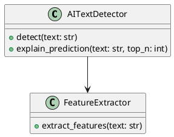

# Документация AI Text Detector

## Содержание

1. [UML Диаграммы](#uml-диаграммы)
2. [Требования к системе](#требования-к-системе)
3. [Как использовать](#как-использовать)

---

## UML Диаграммы

### 1. Use Case диаграмма ([usecase_diagram.puml](usecase_diagram.puml))

**Описание**: Диаграмма вариантов использования показывает основных акторов системы и их взаимодействие с функциональными возможностями.

**Акторы**:
- **Исследователь**: фокус на анализе данных, сравнении моделей, визуализации
- **Разработчик**: интеграция системы, обучение моделей, работа с API
- **Конечный пользователь**: детекция текстов, получение объяснений

**Основные прецеденты**:
- Обучение модели на датасете
- Детекция текста
- Получение объяснения предсказания
- Визуализация результатов
- Извлечение признаков из текста
- Сравнение моделей
- Пакетная обработка текстов

### 2. Диаграмма последовательности ([sequence_diagram.puml](sequence_diagram.puml))

**Описание**: Показывает взаимодействие компонентов системы во время процесса детекции текста.

**Основные потоки**:
1. **Инициализация**: загрузка модели и подготовка детектора
2. **Анализ текста**: извлечение признаков → классификация → формирование результата
3. **Объяснение предсказания**: анализ важности признаков

**Компоненты**:
- Detector: главный интерфейс
- FeatureExtractor: извлечение признаков (стилометрия, синтаксис, семантика)
- Classifier: модель классификации (XGBoost/Neural)
- Model Storage: хранилище обученных моделей

### 3. Диаграмма активностей ([activity_diagram.puml](activity_diagram.puml))

**Описание**: Детально описывает процесс обучения модели от загрузки данных до сохранения результатов.

**Этапы процесса**:
1. Выбор источника данных (директории/CSV/пример)
2. Валидация и разделение данных
3. Извлечение и нормализация признаков
4. Обучение классификатора(ов)
5. Оценка качества на тестовой выборке
6. Визуализация результатов
7. Сохранение моделей и отчетов

---

## Требования к системе

Полная спецификация требований находится в файле [REQUIREMENTS.md](REQUIREMENTS.md).

### Краткое содержание:

#### 1. Функциональные требования (FR)
- **FR-1**: Обучение моделей (загрузка данных, извлечение признаков, обучение XGBoost/Neural Network)
- **FR-2**: Детекция текстов (анализ, объяснение, пакетная обработка)
- **FR-3**: Визуализация (графики важности, confusion matrix, ROC-кривая)
- **FR-4**: Поддержка языков (английский, русский, облегченный режим)
- **FR-5**: Интеграция и расширяемость (API, кастомные признаки)

#### 2. Нефункциональные требования (NFR)
- **NFR-1**: Производительность (детекция < 1 сек, обучение XGBoost < 5 мин)
- **NFR-2**: Надежность (обработка ошибок, отказоустойчивость)
- **NFR-3**: Удобство использования (простая установка, интуитивный CLI)
- **NFR-4**: Поддерживаемость (модульность, тесты, документация)
- **NFR-5**: Переносимость (Windows/macOS/Linux, Python 3.8+)
- **NFR-6**: Безопасность (локальная обработка, защита от injection)
- **NFR-7**: Масштабируемость (до 100K текстов, расширяемая архитектура)

#### 3. Требования к точности (AR)

**Минимальные метрики** (на сбалансированном датасете 500+ текстов/класс):
- Accuracy ≥ 75%
- Precision ≥ 70%
- Recall ≥ 70%
- F1-Score ≥ 70%
- AUC-ROC ≥ 0.80

**Целевые метрики**:
- Accuracy ≥ 85%
- Precision ≥ 82%
- Recall ≥ 82%
- F1-Score ≥ 82%
- AUC-ROC ≥ 0.90

**Точность по длине текста**:
- Короткие (50-100 слов): ≥ 65%
- Средние (100-500 слов): ≥ 75%
- Длинные (500+ слов): ≥ 80%

**Калибровка уверенности**:
- High confidence (≥ 0.85): можно доверять
- Medium confidence (0.65-0.85): требуется осторожность
- Low confidence (< 0.65): результат ненадежен

---

## Как использовать

### Просмотр UML диаграмм

#### Вариант 1: PlantUML онлайн
1. Перейдите на [PlantUML Online Server](https://www.plantuml.com/plantuml/uml/)
2. Скопируйте содержимое `.puml` файла
3. Вставьте в редактор и получите визуализацию

#### Вариант 2: VS Code с расширением
1. Установите расширение "PlantUML" в VS Code
2. Откройте `.puml` файл
3. Нажмите `Alt+D` для предварительного просмотра

#### Вариант 3: Генерация PNG
Если у вас установлен PlantUML локально:
```bash
# Установка (требуется Java)
# Windows: choco install plantuml
# macOS: brew install plantuml
# Linux: apt-get install plantuml

# Генерация изображений
cd docs
plantuml usecase_diagram.puml
plantuml sequence_diagram.puml
plantuml activity_diagram.puml
```

### Структура документации

```
docs/
├── README_DOCS.md            # Этот файл (обзор документации)
├── REQUIREMENTS.md           # Полная спецификация требований
├── usecase_diagram.puml      # Use Case диаграмма
├── sequence_diagram.puml     # Диаграмма последовательности
└── activity_diagram.puml     # Диаграмма активностей
```

---

## Связь с кодом

### Use Cases → Код

| Use Case | Реализация |
|----------|-----------|
| Обучить модель | [train.py](../train.py) |
| Детектировать текст | [detect.py](../detect.py), [src/detector.py](../src/detector.py) |
| Извлечь признаки | [src/feature_extractor.py](../src/feature_extractor.py) |
| Визуализировать | [src/visualizer.py](../src/visualizer.py) |
| Классификация | [src/classifiers.py](../src/classifiers.py) |

### Компоненты → Файлы

| Компонент | Файл | Описание |
|-----------|------|----------|
| Detector | [src/detector.py](../src/detector.py) | Главный интерфейс для детекции |
| FeatureExtractor | [src/feature_extractor.py](../src/feature_extractor.py) | Извлечение стилометрических, синтаксических, семантических признаков |
| XGBoostClassifier | [src/classifiers.py](../src/classifiers.py) | Классификатор на основе XGBoost |
| NeuralNetTrainer | [src/classifiers.py](../src/classifiers.py) | Обучение нейронной сети |
| Visualizer | [src/visualizer.py](../src/visualizer.py) | Генерация графиков и визуализаций |

### Признаки (Features) → Код

Все признаки извлекаются в [src/feature_extractor.py](../src/feature_extractor.py):

**Стилометрические** (`extract_stylometric_features`):
- sentence_length_mean/std
- type_token_ratio
- hapax_legomena_ratio
- stopword_ratio
- punctuation_density

**Синтаксические** (`extract_syntactic_features`):
- syntax_tree_depth_mean/std
- comma_pattern_variance
- dependency_distance_mean
- pos_diversity

**Семантические** (`extract_semantic_features`):
- named_entity_density
- first_person_pronoun_ratio
- negation_frequency
- modal_verb_ratio
- adj_noun_ratio

---

## Расширение документации

### Добавление новых диаграмм

1. **Class диаграмма** - для описания структуры классов:


2. **Component диаграмма** - для архитектуры системы

3. **Deployment диаграмма** - для развертывания

### Обновление требований

При добавлении новых функций обновите:
1. Соответствующий раздел в [REQUIREMENTS.md](REQUIREMENTS.md)
2. Use Case диаграмму (если новый прецедент)
3. Sequence/Activity диаграммы (если изменяется поток)

---

## Дополнительные ресурсы

- **PlantUML Documentation**: https://plantuml.com/
- **UML Best Practices**: https://www.visual-paradigm.com/guide/uml-unified-modeling-language/
- **Software Requirements Specification**: https://en.wikipedia.org/wiki/Software_requirements_specification

---

## Обновления

**Версия 1.0** (2026-01-15):
- Начальная версия документации
- Use Case, Sequence, Activity диаграммы
- Полная спецификация требований (FR, NFR, AR)
